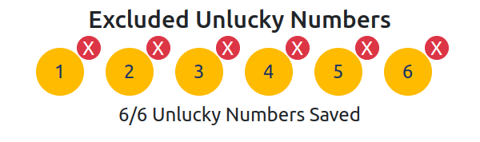
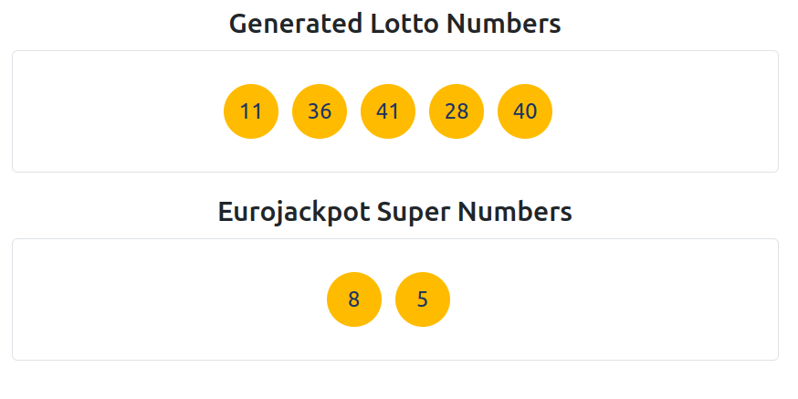

# Lotto Numbers Generator

This project is a web application that generates random Lotto numbers and allows users to specify numbers they wish to exclude from the generation process. It supports different Lotto types and provides a user-friendly interface to interact with the number generation logic.

## Motivation

The motivation behind this project was to create a tool that can help Lotto enthusiasts to generate numbers while avoiding certain 'unlucky' numbers they don't want to include.

## Features

- Generate random Lotto numbers for different Lotto types.
- Allow users to specify and save 'unlucky' numbers to exclude from the generation process.
- Provide a responsive web interface that is easy to navigate and use.

## Table of Contents

- [Installation](#installation)
- [Usage](#usage)

## Installation

### Running the Lotto Numbers Generator Locally

The Lotto Numbers Generator project uses JavaScript for the frontend and PHP for the backend. 
To run this project locally, you'll need a local server environment. 
XAMPP is an easy-to-use option that will allow you to run PHP code and serve your project on your computer. 
Here’s how to set it up on Mac, Windows, and Linux:

#### Step 1: Install XAMPP

- **Windows and Linux:**
1. Go to the [Apache Friends website](https://www.apachefriends.org/index.html) and download the XAMPP installer for your operating system.
2. Open the downloaded file and follow the installation instructions. Default settings should be fine for most users.
3. Once installed, open XAMPP Control Panel. You might need to search for it in your applications menu.

- **Mac:**
1. Visit the [Apache Friends website](https://www.apachefriends.org/index.html) to download XAMPP for Mac.
2. Open the downloaded file (a DMG file) and follow the instructions to drag XAMPP into your Applications folder.
3. Launch XAMPP from your Applications folder. It may prompt you to allow permissions the first time you run it.

#### Step 2: Start the Apache Server

- In the XAMPP Control Panel, you’ll see a list of services. Find the Apache module and click the ‘Start’ button next to it. This starts your local server. You should see the status turn to green, indicating that Apache is running.

#### Step 3: Clone the Project

- Open Terminal on Mac/Linux or Command Prompt on Windows.
- Navigate to the htdocs directory in your XAMPP installation folder using the `cd` command. For example:
    - **Windows:** `cd c:\xampp\htdocs\`
    - **Mac/Linux:** `cd /Applications/XAMPP/htdocs/` (Mac users might need to adjust based on where XAMPP was installed).
- Clone the project repository by running:
  ```bash
  git clone https://github.com/RodriguesCarolina/lotto-numbers-draw.git
  ```
- Change directory to your project folder:
  ```bash
  cd lotto-numbers-draw
  ```

#### Step 4: Access Your Project

- Open your preferred web browser.
- Type `localhost/lotto-numbers-generator` in the address bar and press Enter.
- You should now see the Lotto Numbers Generator web application running locally on your machine.

#### Additional Notes for Users

- **File Location:** All files for your project must be located in the `htdocs` folder inside your XAMPP installation directory. This is where Apache serves files from.
- **Stopping the Server:** When you're done, you can stop the Apache server by going back to the XAMPP Control Panel and clicking the 'Stop' button next to Apache. This will free up your system's port until you need to start the server again.

## Usage

This section provides a comprehensive guide on how to utilize the Lotto Numbers Generator project effectively. 
This web application allows users to generate random lotto numbers while excluding specific "unlucky" numbers of their choice.

### Getting Started

1. **Starting the Application**: After cloning the project and setting it up on your local machine (refer to the installation section), navigate to the project directory and open the `index.html` file in a modern web browser to start the application.

2. **Choosing Lotto Type**: At the top of the application, you will find options to select the type of lotto for which you want to generate numbers (e.g., "LOTTO 6aus49" or "Eurojackpot"). Select your preferred lotto type.

   

### Excluding Unlucky Numbers

3. **Entering Unlucky Numbers**: Below the lotto type selection, there is an input field where you can enter the numbers you wish to exclude from the generated results. Enter the numbers separated by commas, then click the "Submit Unlucky Numbers" button to save them.

   


4. **Viewing Excluded Numbers**: Once submitted, the excluded numbers will be displayed below the input field. Each number will have an "X" button next to it, allowing you to remove it from the list of excluded numbers if desired.

   

### Generating Lotto Numbers

5. **Generating Numbers**: With your unlucky numbers set, click the "Generate Numbers" button to produce a set of random lotto numbers that do not include any of your specified unlucky numbers.

   

6. **Viewing Generated Numbers**: The generated numbers will be displayed in a visually appealing format below the "Generate Numbers" button. If applicable (e.g., for Eurojackpot), super numbers will also be generated and displayed separately.

   

### Additional Information
- **Number Limits**: Users are allowed to enter up to 6 unlucky numbers. If no new numbers are added, the application will generate lotto numbers using the ones already saved.
- **Number Range**: The range of numbers you can enter is from 1 to 50, adhering to the common range of lotto numbers.
- **Super Numbers**: Super numbers are generated independently and are not influenced by the unlucky numbers selected.
- **Restrictions on Entries**: It is not allowed to add the number 0 or any special characters as unlucky numbers.
- **No Authentication Required**: This application does not require any form of authentication, such as passwords or usernames, ensuring ease of access for all users.
- **Visual Aids**: Throughout the application, visual cues and tooltips are provided to enhance your experience and guide you through the process of generating lotto numbers effectively.


By following these steps, you should be able to use the Lotto Numbers Generator, personalizing your lotto number generation process by excluding numbers you consider unlucky. Enjoy and good luck!
